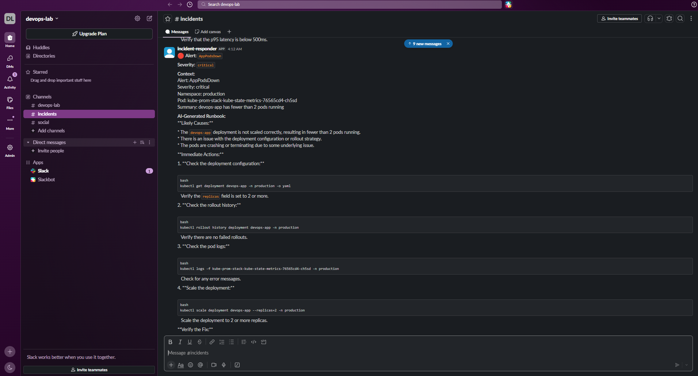
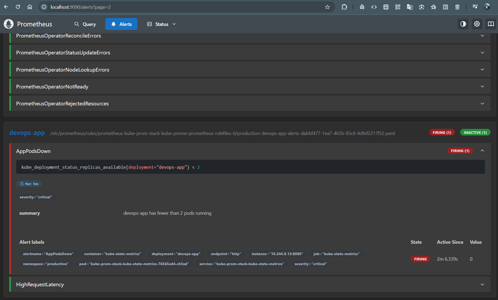
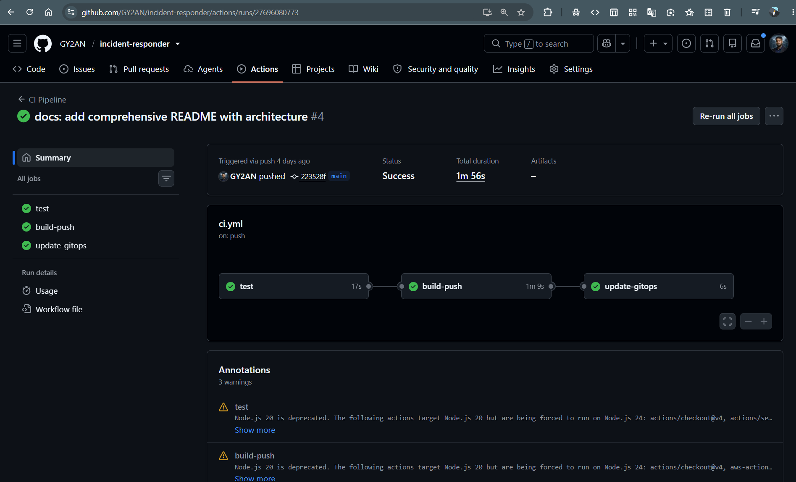
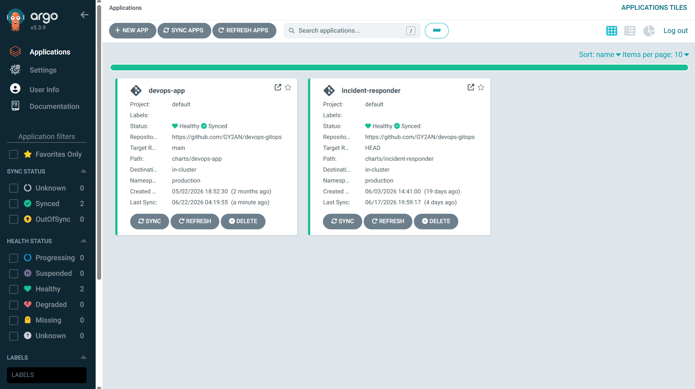
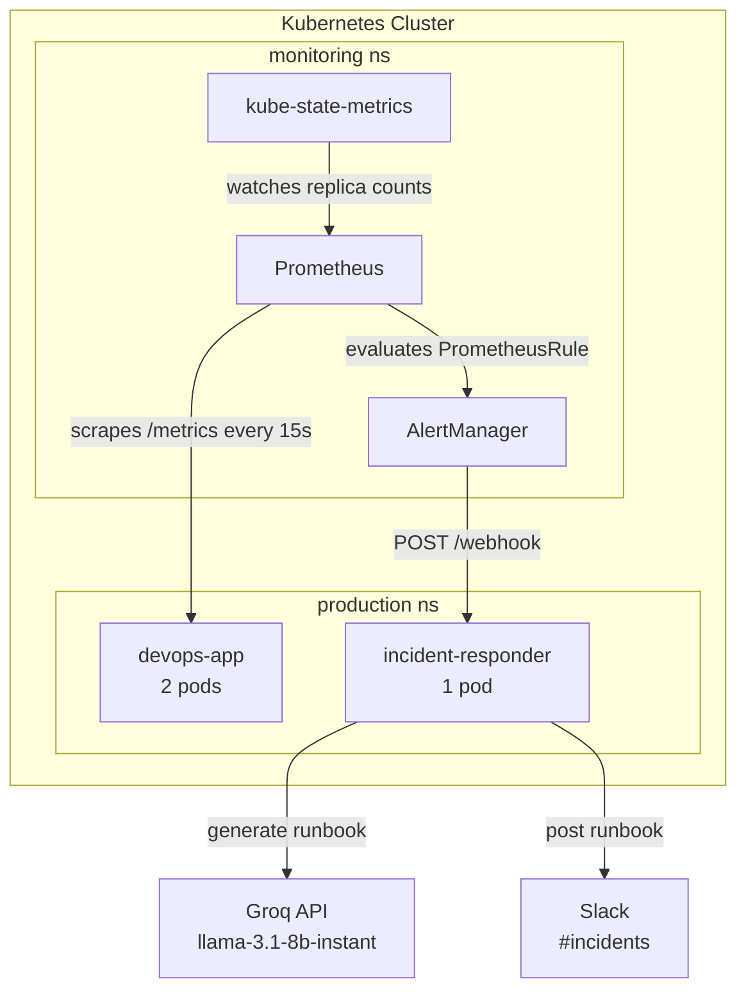

# incident-responder

An AI-powered incident response bot that watches Prometheus alerts, generates runbooks using an LLM, and posts them to Slack — fully deployed to Kubernetes via Helm, ArgoCD GitOps, and a GitHub Actions CI/CD pipeline.

---

## Demo

### Slack runbook notification
> Replace with a screenshot of the Slack #incidents message showing the AI-generated runbook



### Prometheus alert firing
> Replace with a screenshot of http://localhost:9090/alerts showing AppPodsDown in Firing state



### GitHub Actions pipeline passing
> Replace with a screenshot of the Actions tab showing all 3 jobs green



### ArgoCD synced deployment
> Replace with a screenshot of the ArgoCD UI showing incident-responder Synced + Healthy



---

## How it works

```
devops-app pods expose /metrics
        │
        ▼
Prometheus scrapes via ServiceMonitor every 15s
kube-state-metrics tracks replica counts
        │
        ▼  (AppPodsDown fires after 1 min)
AlertManager routes POST → incident-responder.production.svc.cluster.local/webhook
        │
        ▼
alert_handler.py parses AlertPayload
  — alertname, severity, namespace, pod, summary
        │
        ▼
groq_client.py calls llama-3.1-8b-instant
  — likely causes, immediate actions, verification steps
        │
        ▼
slack_client.py posts AI runbook to #incidents
```

---

## Architecture



---

## CI/CD pipeline

Every push to `main` triggers a 3-stage GitHub Actions pipeline:

```
git push origin main
        │
        ▼
[1] test
    ruff check + pytest
        │
        ▼
[2] build-push
    docker build → Trivy scan (CRITICAL CVEs block push) → ECR push
    image tag = git SHA
        │
        ▼
[3] update-gitops
    sed image tag in devops-gitops/charts/incident-responder/values.yaml
    git push → ArgoCD detects → rolling deploy to production ns
```

### Pipeline screenshot
> Replace with a screenshot showing all 3 jobs passing with durations


---

## Tech stack

| Layer | Technology |
|---|---|
| Bot framework | FastAPI + Uvicorn |
| AI model | Groq API — `llama-3.1-8b-instant` |
| Alerting | Prometheus + AlertManager |
| Kubernetes state | kube-state-metrics |
| Notifications | Slack SDK |
| Container runtime | Docker |
| Orchestration | Kubernetes (Docker Desktop) |
| GitOps | ArgoCD |
| Packaging | Helm |
| CI/CD | GitHub Actions |
| Image registry | AWS ECR (ap-south-1) |
| Security scanning | Trivy |
| Data validation | Pydantic v2 |
| Linting | ruff |

---

## Project structure

```
incident-responder/
├── app/
│   ├── main.py              # FastAPI app — /health /ready /webhook
│   ├── alert_handler.py     # Parses AlertPayload, orchestrates flow
│   ├── groq_client.py       # Calls Groq API, returns AI runbook
│   └── slack_client.py      # Posts runbook to Slack
├── tests/
│   └── test_alert_handler.py
├── .github/
│   └── workflows/
│       └── ci.yml           # test → build → scan → push → gitops update
├── Dockerfile
├── requirements.txt
├── requirements-dev.txt
└── pyproject.toml
```

---

## Alerts handled

| Alert | Prometheus query | For | Severity |
|---|---|---|---|
| `AppPodsDown` | `kube_deployment_status_replicas_available{deployment="devops-app"} < 2` | 1m | critical |
| `HighRequestLatency` | `histogram_quantile(0.95, rate(app_request_latency_seconds_bucket[5m])) > 0.5` | 2m | warning |

---

## Example AI runbook output

> Replace with the actual Slack message text your bot generated during testing

```
Alert: AppPodsDown
Severity: critical
Namespace: production

--- AI Runbook ---

## Likely Causes
- Pod crash loop due to OOMKilled or failed liveness probe
- Image pull failure (ECR token expired or wrong tag)
- Node pressure causing pod eviction

## Immediate Actions
1. Check pod status:
   kubectl get pods -n production
   kubectl describe pod <pod-name> -n production

2. Check recent events:
   kubectl get events -n production --sort-by='.lastTimestamp'

3. Check logs:
   kubectl logs -n production -l app=devops-app --tail=50

4. If image pull issue, refresh ECR secret:
   ./scripts/refresh-ecr-secret.ps1

## Verify the Fix
kubectl get deployment devops-app -n production
# Expected: READY 2/2
```

---

## API endpoints

| Method | Path | Description |
|---|---|---|
| `GET` | `/health` | Liveness probe — returns `{"status":"healthy"}` |
| `GET` | `/ready` | Readiness probe |
| `POST` | `/webhook` | Receives AlertManager webhook payload |

### Webhook payload format

```json
{
  "alerts": [
    {
      "status": "firing",
      "labels": {
        "alertname": "AppPodsDown",
        "severity": "critical",
        "namespace": "production"
      },
      "annotations": {
        "summary": "devops-app has fewer than 2 pods running"
      }
    }
  ],
  "groupLabels": {},
  "commonAnnotations": {}
}
```

---

## Kubernetes deployment

The bot is deployed via Helm chart managed by ArgoCD in the `production` namespace. The CI pipeline updates the image tag in the gitops repo on every successful build — ArgoCD handles the rest automatically.

```
devops-gitops/
└── charts/
    └── incident-responder/
        ├── Chart.yaml
        ├── values.yaml          # image tag updated by CI on every push
        └── templates/
            ├── deployment.yaml
            └── service.yaml
```

Secrets are stored as Kubernetes Secrets — never in Git:

```bash
kubectl create secret generic incident-responder-secrets \
  -n production \
  --from-literal=GROQ_API_KEY="your-groq-key" \
  --from-literal=SLACK_BOT_TOKEN="your-xoxb-token" \
  --from-literal=SLACK_CHANNEL_ID="your-channel-id"
```

---

## Local development

### Prerequisites

- Docker Desktop with Kubernetes enabled
- Python 3.11+
- Groq API key — [console.groq.com](https://console.groq.com)
- Slack Bot Token — [api.slack.com/apps](https://api.slack.com/apps)

### Run locally

```bash
docker build -t incident-responder:local .

docker run -d -p 8001:8000 \
  --name ir-test \
  -e GROQ_API_KEY=your-key \
  -e SLACK_BOT_TOKEN=your-token \
  -e SLACK_CHANNEL_ID=your-channel-id \
  incident-responder:local

# Health check
curl http://localhost:8001/health

# Send a test alert
curl -X POST http://localhost:8001/webhook \
  -H "Content-Type: application/json" \
  -d '{
    "alerts": [{
      "status": "firing",
      "labels": {
        "alertname": "AppPodsDown",
        "severity": "critical",
        "namespace": "production"
      },
      "annotations": {
        "summary": "devops-app has fewer than 2 pods running"
      }
    }],
    "groupLabels": {},
    "commonAnnotations": {}
  }'
```

### Run tests

```bash
pip install -r requirements.txt -r requirements-dev.txt
pytest tests/ -v
```

---

## Key challenges

**ArgoCD self-healing vs manual scaling** — ArgoCD continuously reconciles the cluster state against the gitops repo. Any manual `kubectl scale` is immediately reverted. Testing required temporarily patching `syncPolicy: null` or editing `values.yaml` directly in the gitops repo.

**AlertManager notification deduplication** — AlertManager tracks sent notifications in an `nflog` on disk. During testing, alerts that had already fired wouldn't re-trigger webhooks until the `repeat_interval: 1h` elapsed or the nflog was cleared. Understanding this saved significant debugging time.

**Groq client lazy initialization** — The original code initialized the Groq client at module import time, which caused `pytest` to fail in CI because `GROQ_API_KEY` wasn't set. Fixed by wrapping initialization in a `_get_client()` function called only at request time.

**PowerShell JSON escaping** — kubectl patch commands with inline JSON fail silently or error in PowerShell due to quote handling. All patches were moved to `--patch-file` with `Set-Content` to avoid this.

---

## GitHub Actions secrets required

| Secret | Description |
|---|---|
| `AWS_ACCESS_KEY_ID` | IAM credentials for ECR push |
| `AWS_SECRET_ACCESS_KEY` | IAM credentials for ECR push |
| `GITOPS_PAT` | GitHub PAT with `repo` scope to push to devops-gitops |

---

## Related repositories

- [devops-gitops](https://github.com/GY2AN/devops-gitops) — Helm charts and ArgoCD Application manifests
- [devops-app](https://github.com/GY2AN/devops-app) — The monitored application with Prometheus instrumentation
